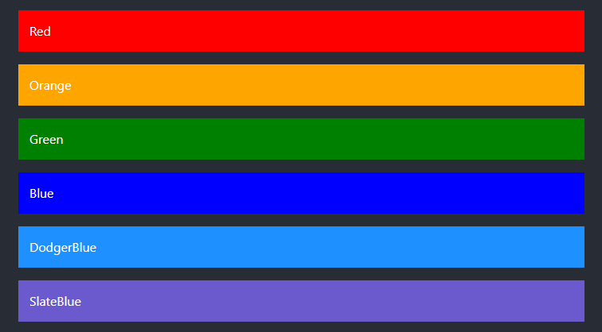
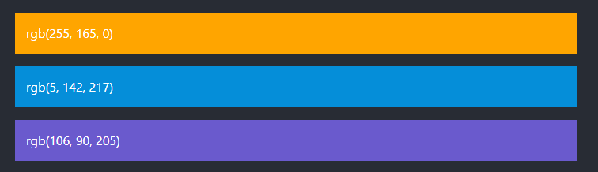
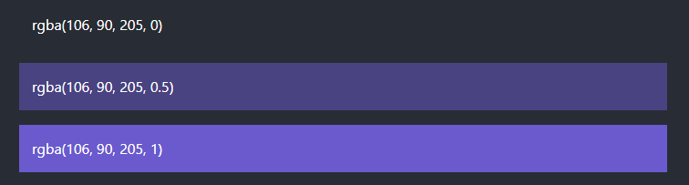
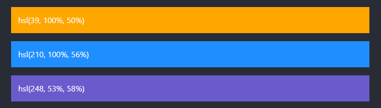
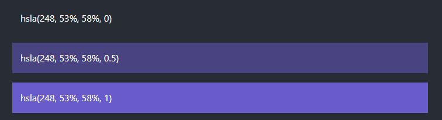
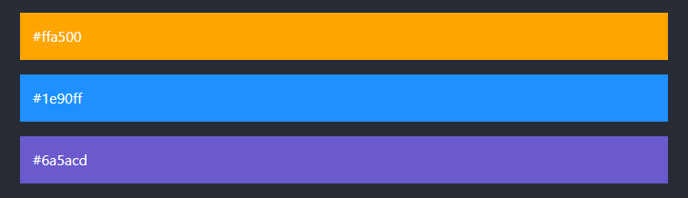

## CSS Colors

### Apa Itu CSS Colors?

Sesuai dengan namanya, css colors adalah syntax untuk memberi warna pada elemen HTML.
Warna dapat ditentukan menggunakan:

- Nama warna yang telah ditentukan
- Nilai RGB
- Nilai RGBA
- Nilai HSL
- Nilai HSLA
- Nilai HEX

### Nama warna dalam CSS

Di CSS, warna dapat ditentukan dengan menggunakan nama warna yang telah ditentukan:

Dan masih banyak lagi.

### Nilai RGB

Di CSS, warna dapat ditentukan sebagai nilai RGB, menggunakan rumus ini:

`rgb(red, green, blue)`

Setiap parameter (red, green, blue) mendefinisikan intensitas warna antara 0 dan 255.

Contoh:

### Nilai RGBA

Sama seperti RGB, hanya saja di RGBA, kita dapat menambahkan properti alpha (opacity).

`rgba(red, green, blue, alpha)`

Parameter alpha adalah angka antara 0.0 (sepenuhnya transparan) dan 1.0 (tidak transparan sama sekali):

Contoh:

### Nilai HSL

Di CSS, warna dapat ditentukan menggunakan hue, saturation, dan lightness (HSL) dalam bentuk:

`hsl(hue, saturation, lightness)`

Contoh:

### Nilai HSLA

Sama seperti HSL, hanya saja di HSLA, kita dapat menambahkan properti alpha (opacity).

`hsla(hue, saturation, lightness, alpha)`

Parameter alpha adalah angka antara 0.0 (sepenuhnya transparan) dan 1.0 (tidak transparan sama sekali):

Contoh:

### Nilai HEX

Warna heksadesimal ditentukan dengan: #RRGGBB, di mana bilangan bulat heksadesimal RR (merah), GG (hijau) dan BB (biru) menentukan komponen warna.

`#rrggbb`

Contoh:

