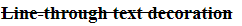
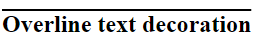

# TEXT DECORATION

## Apa itu text decoration

Text decoration adalah sebuah property css yang berfungsi untuk memberi garis bawah terhadap suatu element.
ada beberapa value untuk text decoration ini yaitu :

- none
- underline
- line through
- overline

## Langsung saja ke demonya

- none

```css
a {
  text-decoration: none;
}
```

Biasanya `text-decoration: none ` berfungsi untuk menghilangkan garis bawah pada sebuah `<a>`atau link.

---

- underline

```css
h3 {
  text-decoration: underline;
}
```

Fungsinya untuk menggaris bawahi sebuah element.

---

- line through

```css
h3 {
  text-decoration: line-through;
}
```

Fungsinya untuk memberikan garis di tengah-tengah element.

### Demo



---

- overline

```css
h2 {
  text-decoration: overline;
}
```

Fungisnya untuk memberikan garis di atas kalimat.

### Demo



## Referensi [W3SCHOOLS](https://www.w3schools.com/css/css_text_decoration.asp)
