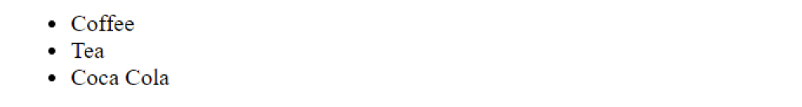
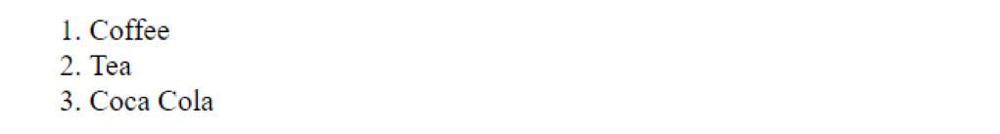
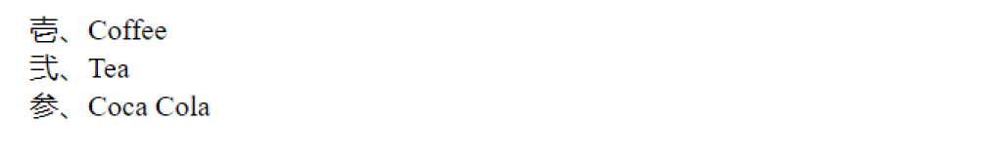
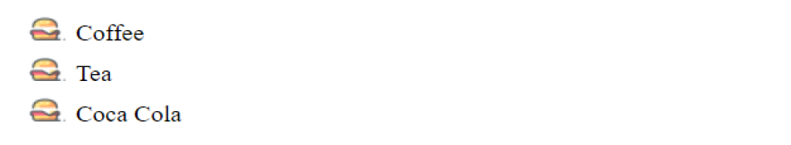
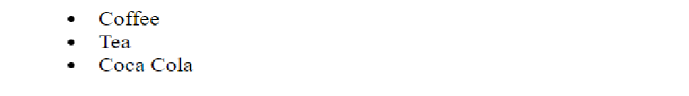

# CSS List

Pada CSS, List adalah sebuah elemen yang digunakan untuk membuat daftar item yang tersusun. List biasa digunakan untuk menampilkan daftar barang semacam _to-do list_.

Untuk membuat List di HTML, kamu bisa menggunakan elemen seperti `ul` atau `ol` sebagai wadahnya dan untuk membuat item-item yang didaftar kamu bisa menggunakan elemen `li`.

```html
<ul>
  <li>Coffee</li>
  <li>Tea</li>
  <li>Coca Cola</li>
</ul>
```

## Perbedaan `ul` dan `ol`

Ada perbedaan antara elemen `ul` dan `ol`, Elemen `ul` digunakan untuk membuat daftar bullet, sedangkan elemen `ol` digunakan untuk membuat daftar numerik atau tiap-tiap item diwakili dengan angka secara berurutan.

Daftar bullet:



Daftar numerik:



Ada beberapa properti yang bisa kamu gunakan untuk men-style list.

## list-style-type

Properti `list-style-type` untuk mengatur tanda pada daftar.

Contoh:

```css
ul {
  list-style-type: japanese-formal;
}
```

Seperti yang kamu lihat, list bisa diiubah dengan tulisan angka jepang. Kamu juga bisa memberikan value lain seperti `ethiopic-numeric` dan `square`.

Hasil:


## list-image

Kamu juga dapat meng-custom tanda dengan gambar menggunakan properti `list-image`.

Contoh:

```css
ul {
  list-style-image: url("icons8-beef-burger-24.png");
}
```

Hasil:


## list-position

Porperti `list-position` untuk mengatur posisi tanda list dan hanya memiliki dua value yaitu `inside` dan `outside`.

Contoh:

```css
ul {
  list-style-position: inside;
}
```

Hasil:


Jika diperhatikan lebih dalam melalui _inspect_ di browser, kamu akan menemukan bahwa tanda `list` berada dalam sebuah content yang mana secara default tanda `list` seharusnya berada di luar content. Jika kamu ingin memberikan nilai `outside` sebaiknya tidak perlu ditulis karena tanpa di tulis pun tanda list memang posisinya `outside` atau di luar content.

Dari semua properti di atas bisa ditulis sekaligus dalam properti `list-style`.

```css
list-style: georgian inside url("icons8-beef-burger-24.png");
```

```css
list-style: square inside url("sqpurple.gif");
```

### Referensi:

- https://www.w3schools.com/css/css_list.asp
- https://developer.mozilla.org/en-US/docs/Web/CSS/list-style
