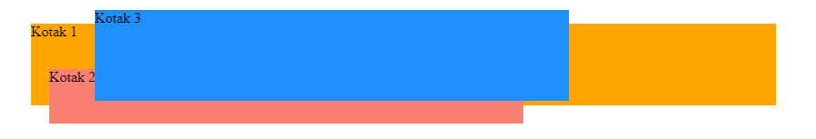
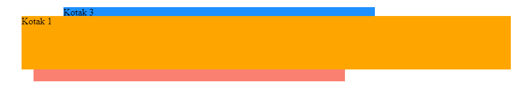

## CSS Z-index

### Apa Itu CSS z-index?

Properti `z-index` adalah properti untuk menentukan urutan tumpukan elemen (elemen mana yang harus ditempatkan di depan, atau di belakang).

Elemen dapat memiliki urutan tumpukan positif atau negatif.

`z-index` hanya berfungsi pada elemen yang memiliki style `position: absolute`, `position: relative`, `position: fixed` dan `position: sticky`.

Contoh tanpa menggunakan `z-index`:

```html
<html>
  <head>
    <style>
      .container {
        position: relative;
      }

      .kotak-1 {
        position: relative;
        background: Orange;
        height: 90px;
        margin: 30px;
        width: 55%;
      }

      .kotak-2 {
        position: absolute;
        background: salmon;
        height: 60px;
        width: 70%;
        left: 50px;
        top: 50px;
        width: 35%;
      }

      .kotak-3 {
        position: absolute;
        background: DodgerBlue;
        width: 35%;
        left: 100px;
        top: -15px;
        height: 100px;
      }
    </style>
  </head>
  <body>
    <div class="container">
      <div class="kotak-1">Kotak 1</div>
      <div class="kotak-2">Kotak 2</div>
      <div class="kotak-3">Kotak 3</div>
    </div>
  </body>
</html>
```

Hasilnya seperti ini:



Contoh menggunakan `z-index`:

```html
<html>
  <head>
    <style>
      .container {
        position: relative;
      }

      .kotak-1 {
        position: relative;
        background: Orange;
        height: 90px;
        margin: 30px;
        width: 55%;
        z-index: 3;
      }

      .kotak-2 {
        position: absolute;
        background: salmon;
        height: 60px;
        width: 70%;
        left: 50px;
        top: 50px;
        width: 35%;
        z-index: 2;
      }

      .kotak-3 {
        position: absolute;
        background: DodgerBlue;
        width: 35%;
        left: 100px;
        top: -15px;
        height: 100px;
        z-index: 1;
      }
    </style>
  </head>
  <body>
    <div class="container">
      <div class="kotak-1">Kotak 1</div>
      <div class="kotak-2">Kotak 2</div>
      <div class="kotak-3">Kotak 3</div>
    </div>
  </body>
</html>
```

Hasilnya seperti ini:


