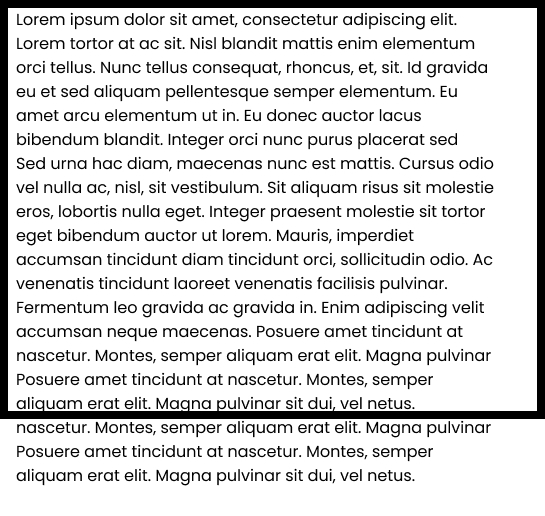
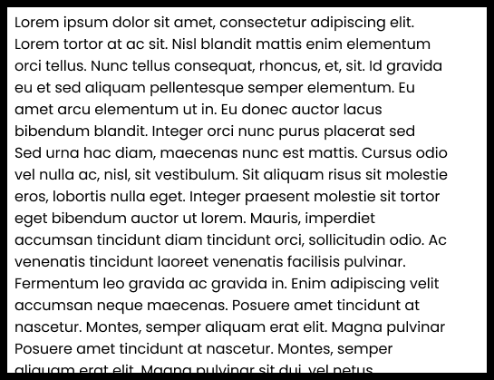
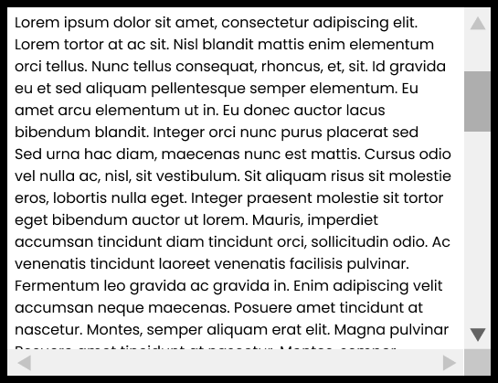
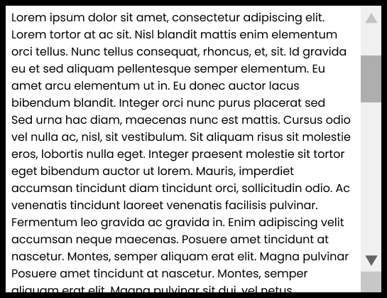

### CSS Overflow

### Apa Itu CSS Overflow?

**CSS Overflow** sendiri adalah properti CSS yang biasa digunakan untuk menentukan sifat suatu konten ketika melewati container atau pembungkusnya, contoh kasus ketika kita membuat sebuah sebuah kotak semisal dengan tag `<div>` dan di dalamnya terdapat sebuah teks dan dibungkus oleh tag `<p>` yang keluar dari container atau pembungkusnya itu disebut dengan `overflow`.

NOTE : Properti `overflow` digunakan untuk menentukan sifat dari sebuah element yang keluar dari container atau pembungkusnya akan dipotong atau menambahkan scroll. Default overflow mempunyai value `visible` yang artinya konten yang keluar dari container atau pembungkusnya akan ditampilkan.

CSS Overflow mempunyai beberapa value, antara lain :

- `overflow: visible` - Default. Konten yang keluar container atau pembungkus akan ditampilkan keluar kotak elemen.



- `overflow: hidden` - Konten akan disembunyikan dan seolah terpotong container / pembungkusnya.



- `overflow: scroll` - Konten terpotong dan akan menampilkan component `scroll` untuk melihat konten lainnya.



- `overflow: auto` - Hampir sama dengan `scroll`, dengan mengimplementasikan value `auto` scroll hanya muncul ketika sebuah element melebihi container atau pembungkusnya.



## Contoh Penggunaan :

```css
div {
  width: 100px;
  height: 100px;
  background-color: #eee;
  overflow: scroll; //sesuaikan kebutuhan
}
```

Untuk referensi lengkapnya, kalian bisa mengunjungi website berikut:

- [MDN Web Docs](https://developer.mozilla.org/en-US/docs/Web/CSS/CSS_Overflow)
- [W3Schools](https://www.w3schools.com/css/css_overflow.asp)
