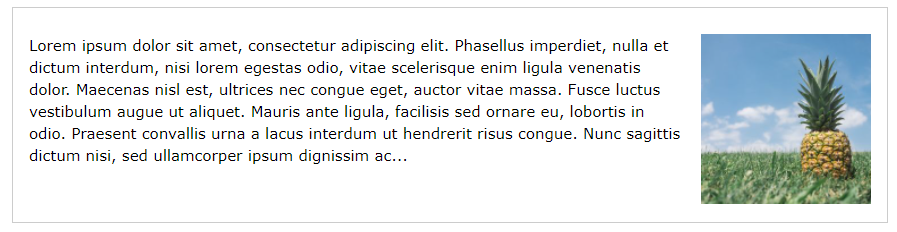

# CSS FLOAT

CSS float adalah property css yang digunakan untuk membuat element mengambang. Biasanya property ini digunakan untuk membuat element di samping element lain.

### Langsung saja ke kodenya

```css
div {
  /* Penjelasan*/
  /* Membuat element mengambang ke kiri */
  float: left;
}
```

### Contoh float left


```css
div {
  /* Penjelasan */
  /* Membuat element mengambang ke kanan */
  float: right;
}
```

### Contoh float right



## Referensi (https://www.w3schools.com/css/css_float.asp)
