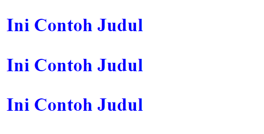

## CSS Important

### Apa Itu CSS Important?

Perintah `!important` berfungsi untuk mengambil alih style yang sudah ditulis pada selector lain, atau bisa juga dikatakan untuk memprioritaskan nilai yang berada di samping perintah `!important` ditulis.

#### Contoh:

```html
<h3>Ini Contoh Judul</h3>
<h3 class="judul">Ini Contoh Judul</h3>
<h3 id="judul">Ini Contoh Judul</h3>
```

```css
h3 {
  color: blue !important;
}

#judul {
  color: green;
}

.judul {
  color: red;
}
```

#### Hasil dan Penjelasan



Terlihat pada output yang dihasilkan semuanya berwarna `biru`, hal ini dikarenakan perintah `!important` akan menimpa value lainnya atau memprioritaskan nilai yang berada di sampingnya walaupun secara posisi selector `h3` berada di atas dan di timpa dengan 2 selector lainnya.