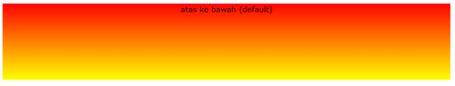
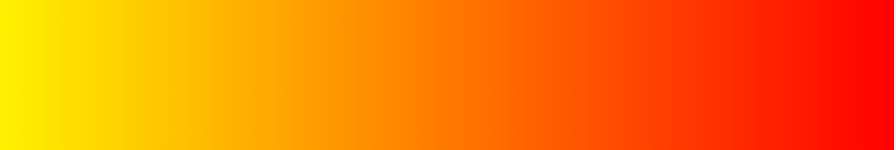
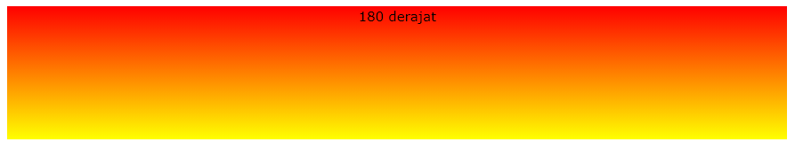
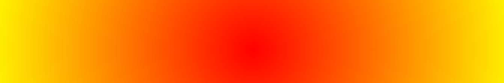

# CSS GRADIENT

## Apa itu CSS gradient

CSS gradient adalah sebuah property dari CSS untuk memberikan sebuah gradasi pada sebuah element, ada 2 property dalam gradient. yaitu

- linear-gradient
- radial-gradient

## Langsung saja ke demonya agar lebih paham

### linear-gradient

```css
div {
  background-image: linear-gradient(arah, color1, color2, ...);
}
```

### Penjelasan

dalam linear-gradient kita bisa menentukan arah gradient, ada beberapa property dalam linear-gradient yaitu

- direction (bentuk default)
- to right
- to left
- to bottom
- diagonal

### Contoh pengunaan dengan 2 warna

## linear-gradient

### direction

```css
div {
  background-image: linear-gradient(direction, red, yellow);
}
```

### Hasil



---

### to-right

```css
div {
  background-image: linear-gradient(to right, red, yellow);
}
```

### Hasil


---

### to-left

```css
div {
  background-image: linear-gradient(to left, red, yellow);
}
```

### Hasil



---

### to-top

```css
div {
  background-image: linear-gradient(to top, red, yellow);
}
```

### Hasil


---

### diagonal

```css
div {
  background-image: linear-gradient(to bottom right, red, yellow);
}
```

### Hasil


---

### Menggunakan sudut

```css
div {
  background-image: linear-gradient(180deg, red, yellow);
}
```

### Hasil



---

## radial-gradient

radial-gradient hanya berpusat pada titik tengah, tidak memiliki arah.

### Contoh penggunaan

```css
div {
  background-image: radial-gradient(circle, red, yellow);
}
```

### Hasil



# NOTE

Penggunaan linear-gradient/radial-gradient bisa manampung warna sesuai keinginan kita bisa lebih dari 2 warna.jadi gunakanlah linear-gradient/radial-gradient sesuai kebutuhan kita.


## Referensi (https://www.w3schools.com/css/css3_gradients.asp)
