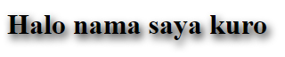

# TEXT SHADOW

## Apa itu text shadow?

text shadow merupakan sebuah property CSS yang digunakan untuk memberikan bayangan pada text

### Langsung saja ke kodenya

Contoh

```html
<h1>Halo nama saya kuro</h1>
```

di file style CSS menggunakan property text-shadow

```css
h1 {
  text-shadow: 3px 5px 10px red;
}
```

## Penjelasan

Untuk menggunakan property text-shadow maka yang harus diperlukan adalah

- `offset-x` : untuk mengatur posisi ke kiri-kanan/horizontal
- `offset-y` : untuk mengatur posisi ke atas-bawah/vertikal
- `spread-radius` : untuk mengatur radius bayangan
- `color` : untuk mengatur warna bayangan

### Penjelasan kode css

- `3px` merupakan `offset-x`
- `5px` merupakan `offset-y`
- `10px` merupakan `spread-radius`
- `red` merupakan `color`

## Hasil


