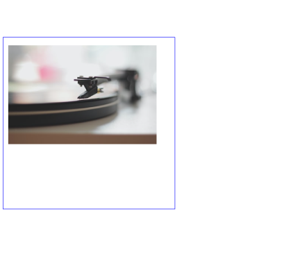
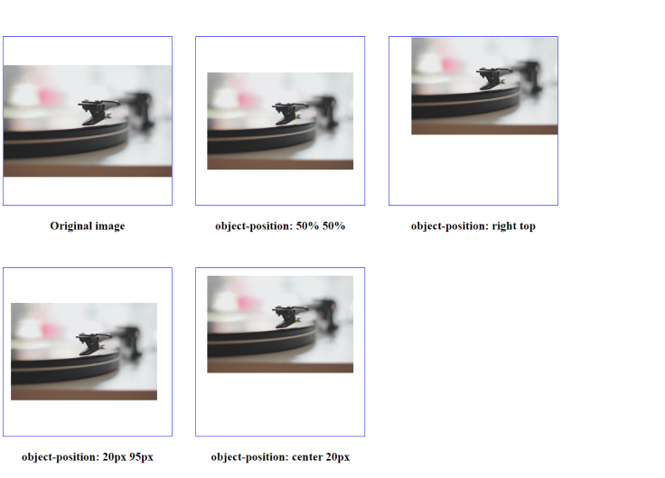

# CSS Object Position

## Apa itu CSS Object Position?

`Object position` merupakan properti CSS yang menentukan posisi objek yang berada di dalam element (misal: `` atau `<video>` ). kamu bisa menggunakan properti ini bersamaan `object-fit` untuk mengatur objek tersebut.

Contohnya jika `object-position:20% 80%`, maka objek akan ditetapkan memilki jarak 20% dari sisi kiri (left) dan 80% dari bagian atas (top) element. contoh lain, `object-position: 50% 50%`, objek akan ditempatkan tepat di tengah element.

```css
img {
  width: 500px;
  height: 500px;
  border: 2px solid blue;
  object-fit: none;
  object-position: 20% 80%;
}
```



Pada penulisan diatas object akan ditetapkan 20% dari sisi kiri dan 80% dari bagian atas element.

## Syntax

Beberapa contoh penerapan yang bisa kamu ikuti:

**Positional values**

```css
object-position: 50% 50%; /* default position */
object-position: right top;
object-position: 20px 95px;
object-position: center 20px; /* mix and match */
```



**Global values**

```css
object-position: inherit;
object-position: initial;
object-position: unset;
```

Mungkin sampai disini dulu pembahasan kali ini, referensi yang bisa kamu gunakan untuk belajar lebih lanjut:

- https://developer.mozilla.org/en-US/docs/Web/CSS/object-position
- https://www.w3schools.com/cssref/css3_pr_object-position.php
- https://css-tricks.com/almanac/properties/o/object-position/
