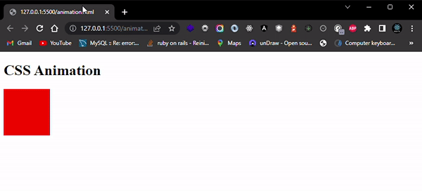

# Animation

Sedikit berbeda dengan **transition**, yang terjadinya animasi hanya ketika ada perubahan kondisi. **Animation** digunakan untuk membuat animasi saat halaman dimuat. **Animasi** dibuat dengan selector **@keyframes** dan digunakan saat property **animation**. Beberapa property yang berhubungan dengan animasi yaitu:

- **Animation-delay**, menunjukkan lama waktu sebelum terjadinya animasi.
- **Animation-duration**, menunjukkan lama waktu terjadinya animasi.
- **Animation-direction**, menunjukkan arah terjadinya animasi, dapat diisi `normal`, `reverse`, dan `alternate-reverse`.
- **Animation-fill-mode**, menunjukkan bagaimana style elemen ketika animasi tidak berjalan, baik sebelum animasi maupun setelahnya, dapat diisi `none`, `forwards`, `backwards`, dan `both`.
- **Animation-iteration-count**, menunjukkan berapa kali animasi akan dijalankan.
- **Animation-name**, menunjukkan nama animasi yang akan dijalankan.
- **Animation-play-state**, menunjukkan animasi berjalan atau pause, dapat diisi `running` atau `paused`.
- **Animation-timing-function**, menunjukkan perubahan kecepatan animasi, isinya sama seperti pada transition.

Sebagai contoh, perhatikan skrip berikut:

```HTML
<!DOCTYPE html>
<html>
    <head>
        <style>
        div {
            width: 100px;
            height: 100px;
            background: red;
            position: relative;
            animation: gerak 2s ease;
        }        
        @keyframes gerak {
            from {left: 20px;}
            30% {left: 800px;}
            to {left: 800px;}
        }
        </style>
    </head>
    <body>
        <h1>CSS Animation</h1>
    <div></div>
    </body>
</html>
```

`From` dapat diganti dengan 0% dan `to` dapat diganti dengan 100%.
Untuk menambahkan keyframe, tambahkan baris baru diawali dengan nilai persentase animasi diikuti perubahan property,
misal : 60%{left: 400px}. Jalankan pada browser untuk melihat hasilnya.


