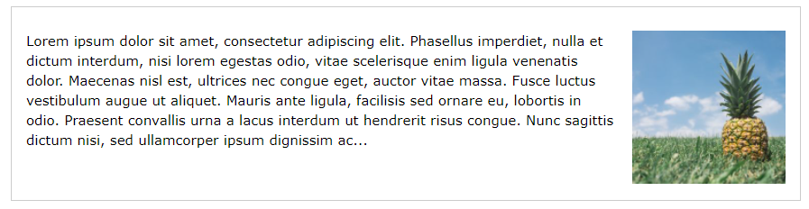

# CSS FLOAT

Css float adalah property css yang digunakan untuk membuat element mengambang.

### Langsung saja ke kodenya

```css
div {
  /* Element mengambang ke kiri */
  float: left;
}
```

### Contoh float left


```css
div {
  /* Element mengambang ke kanan */
  float: right;
}
```
### Contoh float right



## Referensi (https://www.w3schools.com/css/css_float.asp)
