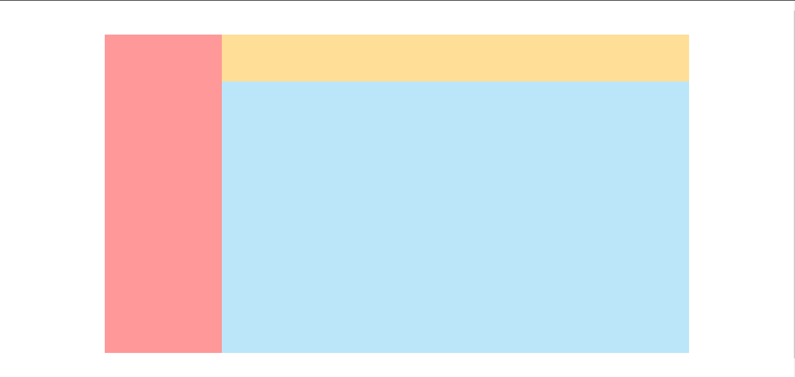
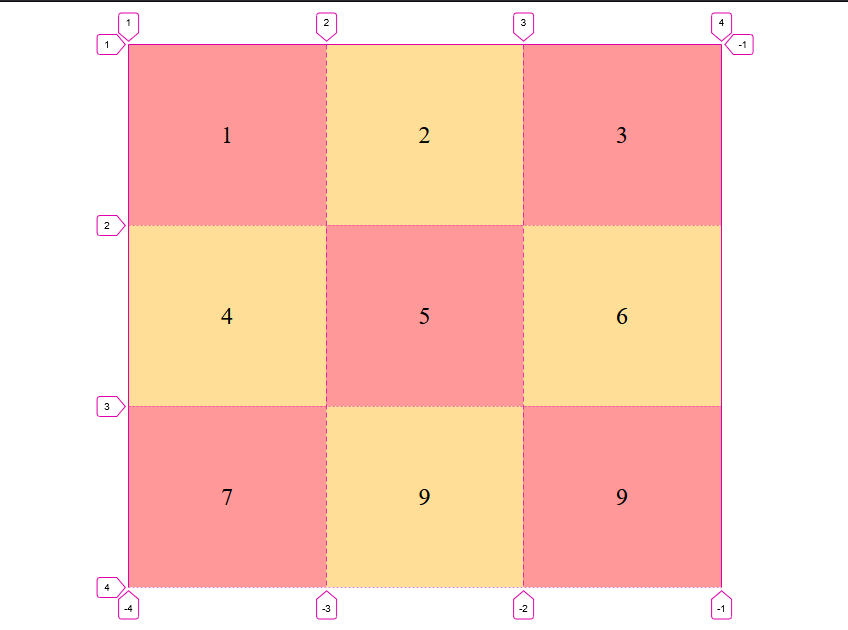
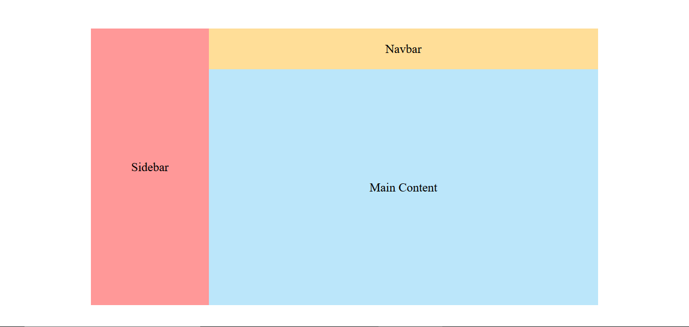
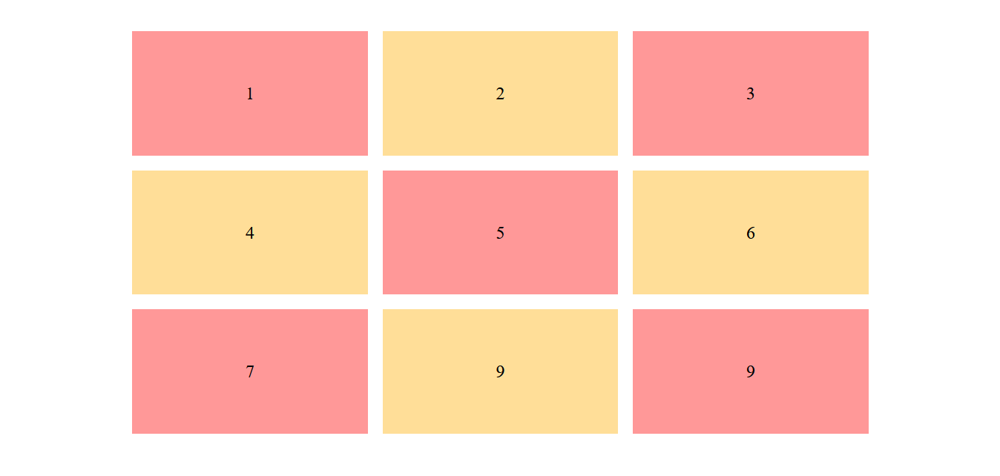

## CSS Grid

### Apa Itu CSS Grid?

Grid adalah metode tata letak `dua dimensi`, yaitu dengan menggunakan `CSS Grid` kita dapat mengatur baris dan kolom pada sebuah element sekaligus. Hal ini berbeda dengan `CSS Flexbox`, dimana dengan menggunakan flexbox, kita hanya dapat mengatur baris atau kolom saja.

### Bagaimana cara menulis CSS Grid?

CSS `grid` dapat di tuliskan dengan mengetikkan `property` dan `value` pada sebuah element, dimana `property`-nya adalah `display` dan `value`-nya adalah `grid`, sehingga penulisan kodenya adalah `display: grid`.

Berikut contoh penulisan _CSS Grid_

```css
.container {
  display: grid;
}
```

## Grid Layout



### Istilah Dalam CSS Grid.

Sebelum kita belajar, alangkah baiknya kalau kita mengetahui _istilah - istilah_ yang ada di dalam `CSS Grid`.
Adapun istilah - istilah yang ada di dalam CSS Grid diantaranya adalah:

- `Grid Container`
- `Grid Item`
- `Grid line`
- `Grid cell`
- `Grid area`
- `Grid track`
- `Grid Gap`

#### Penjelasan

_Grid Container_ adalah element pembungkus grid, dengan cara mengetikkan `display: grid` pada sebuah element, maka element tersebut akan menjadi element pembungkus.

Contoh Kode:

```css
body {
  display: grid;
}
```

dengan mengetikkan kode diatas, maka element `body` akan menjadi _Grid Container_ dan element - element lain yang ada di dalam element body tersebut dapat menggunakan semua `property dan value` dari CSS Grid.

_Grid Item_ adalah element yang berada 1 level dibawah / di dalam element pembungkusnya (Grid Container).

Contoh Kode:

```html
<div class="container">
  <div class="item">Item 1</div>
  <div class="item">Item 2</div>
  <div class="item">Item 3</div>
</div>
```

jika kita memberikan `display: grid` pada element yang classnya `container` maka otomatis semua element yang ada di dalamnya (yaitu class item) akan menjadi sebuah _Grid Item_.

_Grid Line_ adalah garis `horizontal` (kolom) atau `vertikal` (baris) yang memisahkan grid menjadi beberapa bagian dan di tandai dengan `angka`

gambar grid line:


_Grid Cell_ adalah perpotongan antara `baris` dan `kolom` dalam grid.

gambar grid cell:


_Grid Area_ adalah kumpulan lebih dari satu `cell` yang membentuk _kotak_.

gambar grid area:


_Grid Track_ adalah ukuran cell secara `horizontal` maupun `vertical`.

gambar grid track:


_Grid Gap_ adalah jarak antar cell.

gambar grid gap:


### Properti di CSS Grid

Selanjutnya, kita akan mempelajari tentang properti-properti yang ada di `CSS Grid`. Adapun properti-properti yang ada di CSS Grid adalah:

#### Properti untuk element pembungkus (container)

- `grid-template-columns`
- `grid-template-rows`
- `grid-auto-columns`
- `grid-auto-rows`
- `grid-auto-flow`
- `grid-template-areas`
- `grid-template`
- `grid-column-gap`
- `grid-gap`
- `gap`
- `justify-items`
- `align-items`
- `place-items`
- `justify-content`
- `align-content`
- `place-content`

#### Properti untuk item (element yang ada di dalam pembungkus / container)

- `grid-column-start`
- `grid-column-end`
- `grid-row-start`
- `grid-row-end`
- `grid-column`
- `grid-row`
- `grid-area`
- `justify-self`
- `align-self`
- `place-self`

#### Penjelasan

- `grid-template-columns`
  **Yaitu properti untuk mengatur _kolom_ pada sebuah element**.

Cara penulisan kodenya adalah:

```css
.container {
  display: grid;
  grid-template-columns: 3px 3px 3px;
}
```

artinya, kita akan memberikan 3 buah _kolom_ berukuran 3px pada element class `container`.

- `grid-template-rows`
  **Yaitu properti untuk mengatur _baris_ pada sebuah element.**

Cara penulisan kodenya adalah:

```css
.container {
  display: grid;
  grid-template-rows: 3px 3px 3px;
}
```

artinya, kita akan memberikan 3 buah _baris_ pada element class `container`.

**catatan** untuk memberikan ukuran pada sebuah properti grid, kita dapat memasukkan nilai berupa `px`, `%`, `auto`, atau `fr`, sebagai contoh:

```css
.container {
  display: grid;
  grid-template-column: 3px auto 30%;
  grid-template-rows: 1fr 1fr 1fr;
}
```

yang artinya, kita akan membuat 3 buah _kolom_ pada element class `container` berukuran `3px`, `auto` dan `30%` serta 3 buah _garis_ berukuran `1fr`.

- `grid-auto-column`
  **Yaitu properti untuk mengatur kolom secara _implisit_.**

Cara Penulisan Kodenya adalah:

```css
.container {
  display: grid;
  grid-template-column: 3px auto;
  grid-auto-columns: 100px;
}
```

artinya, kita akan membuat sebuah _kolom_ secara `implisit` sebesar 100px.

- `grid-auto-rows`
  **Yaitu properti untuk mengatur baris secara _implisit_.**

Cara penulisan kodenya adalah:

```css
.container {
  display: grid;
  grid-template-rows: 1fr 1fr;
  grid-auto-rows: 100px;
}
```

artinya, kita akan membuat sebuah _baris_ secara `implisit` sebesar 100px.

- `grid-auto-flow`
  **Yaitu properti yang digunakan untuk mengatur penempatan item pada _tracknya_ serta untuk mengubah sebuah element apakah ingin menjadi sebuah kolom ataupun baris.**

Cara penulisan kodenya adalah:

```css
.container {
  display: grid;
  grid-template-column: 30px 30px;
  grid-auto-flow: column;
}
```

artinya, kita akan membuat element yang ada pada class `container` menjadi sebuah kolom dengan ukuran masing-masing kolom adalah 30px.

_Catatan:_ dalam `grid-auto-flow` terdapat 3 buah value yaitu:
`row` untuk mengubah penempatan element menjadi baris dan ini adalah nilai default (jika valuenya tidak di definisikan, maka nilainya adalah row).
`row dense` untuk mengubah penempatan element menjadi baris namun dengan urutan yang dimulai dari belakang.
`column` untuk mengubah penempatan element menjadi kolom.
`column dense` untuk mengubah penempatan element menjadi kolom namun dengan urutan yang dimulai dari belakang.

- `grid-template-areas`
  **Yaitu untuk mendefinisikan template menggunakan nama area yang ditulis pada properti `grid-area` pada item.**

Cara penulisan kodenya adalah:

```css
.container {
  display: grid;
  grid-template-column: 30px 30px;
  grid-template-areas: "nav nav nav" "side main main" "side footer footer";
}
```

artinya, kita akan membuat sebuah _layout_ dengan menggunakan nama dari area yang di inginkan. Dalam hal ini nama areanya adalah _nav side main footer_.

Namun, kodingan diatas hanya mendefinisikan nama serta posisi dari tiap areanya saja dan tidak akan berpengaruh kepada layout yang telah ada, lantas bagaimana cara mengubah layoutnya sesuai dengan area yang telah di definisikan tadi? caranya ternyata sangat mudah, yaitu dengan mengetikkan properti `grid-area: nama area` pada element yang di inginkan.

Cara penulisan kodenya adalah:

```css
.container {
  display: grid;
  grid-template-column: 30px 30px;
  grid-template-areas: "nav nav nav" "side main main" "side footer footer";
}

.div-satu {
  grid-area: nav;
}

.div-dua {
  grid-area: side;
}

.div-tiga {
  grid-area: main;
}

.div-empat {
  grid-area: footer;
}
```

dengan mengetikkan kode tersebut, itu berarti `div-satu` akan menempati posisi pada area `nav` dan membentuk 3 kolom, `div-dua` akan menempati posisi pada area `side` dan membentuk 2 baris, `div-tiga` akan menempati posisi pada area `main` dan membentuk 2 kolom serta `div-empat` akan menempati posisi pada area `footer`dan membentuk 3 kolom.

- `grid-template`
  \*\*Yaitu _shorthand_ atau properti untuk menyingkat tiga buah properti sekaligus yaitu `grid-template-columns`, `grid-template-rows` dan `grid-template-areas`. Namun harus diperhatikan bahwa terdapat aturan dari penulisan `grid-template` ini, dan aturannya yaitu: `grid-template: grid-template-rows, grid-template-columns / grid-template-areas`.

Cara penulisan kodenya adalah:

```css
.container {
  display: grid;
  grid-template: 30px 30px / 1fr 1fr 1fr;
}
```

artinya, kita akan membuat 2 buah baris berukuran masing-masing 30px dan 3 buah kolom berukuran masing-masing 1fr.
Ingat, dalam penulisan `grid-template` ini urutan pertama harus `grid-template-rows` baru `grid-template-column`.

- `grid-column-gap`
  **adalah properti untuk mengatur jarak (gap) antar kolom**.

Cara penulisan kodenya adalah:

```css
.container {
  display: grid;
  grid-template-column: 3px auto 30%;
  grid-column-gap: 10px;
}
```

artinya, setiap kolom yang ada akan diberi jarak sebesar `10px`.

- `grid-gap`
  **Yaitu properti untuk mengatur jarak pada kolom dan baris sekaligus**.

Cara penulisan kodenya adalah:

```css
.container {
  display: grid;
  grid-template-column: 3px auto 30%;
  grid-template-rows: 1fr 1fr 1fr;
  grid-gap: 10px;
}
```

artinya, pada kolom dan baris yang ada akan diberikan jarak sebesar `10px`.

- `gap`
  **Yaitu _shorthand_ atau singkatan dari properti `grid-column-gap`.**

Cara penulisan kodenya adalah:

```css
.container {
  display: grid;
  grid-template-column: 3px auto 30%;
  grid-template-rows: 1fr 1fr 1fr;
  gap: 10px;
}
```

artinya, anda akan memberikan jarak antar kolom dan baris sebesar `10px`, namun dengan penulisan yang lebih mudah dan singkat dibandingkan dengan kedua properti sebelumnya.

- `jusify-items`
  **Yaitu properti untuk _mensejajarkan items_ secara _horizontal_ (dari kanan ke kiri), dimana properti ini memiliki 4 yaitu `start`, `end`, `center` dan `stretch` dimana `stretch` adalah nilai defaultnya.**

PENJELASAN:
`start` untuk memposisikan items pada bagian kiri atas layar.
`center` untuk memposisikan items pada bagian tengah atas layar.
`end` untuk memposisikan items pada bagian kanan atas layar.
`stretch` untuk memposisikan items seluruh layar mulai dari kanan, tengah maupun kiri layar.

Cara penulisan kodenya adalah:

```css
.container {
  display: grid;
  justify-items: center;
  grid-template-column: 3px auto 30%;
  grid-template-rows: 1fr 1fr 1fr;
  gap: 10px;
}
```

artinya kita akan membuat items yang ada berada di tengah layar secara horizontal.

- `align-items`
  **Yaitu properti untuk _mensejajarkan items_ secara _vertical_ (dari atas ke bawah), dimana properti ini memiliki 4 yaitu `start`, `end`, `center` dan `stretch` dimana `stretch` adalah nilai defaultnya.**

PENJELASAN:
`start` untuk memposisikan items pada bagian kiri atas layar.
`center` untuk memposisikan items pada bagian tengah atas layar.
`end` untuk memposisikan items pada bagian kanan atas layar.
`stretch` untuk memposisikan items seluruh layar mulai dari kanan, tengah maupun kiri layar.

Cara penulisan kodenya adalah:

```css
.container {
  display: grid;
  align-items: center;
  grid-template-column: 3px auto 30%;
  grid-template-rows: 1fr 1fr 1fr;
  gap: 10px;
}
```

artinya kita akan membuat items yang ada berada di tengah layar secara vertical.

- `place-items`
  **Yaitu properti untuk _mensejajarkan items_ secara horizontal dan vertical sekaligus, dimana properti ini memiliki 4 yaitu `start`, `end`, `center` dan `stretch` dimana `stretch` adalah nilai defaultnya.**

PENJELASAN:
`start` untuk memposisikan items pada bagian kiri atas layar.
`center` untuk memposisikan items pada bagian tengah atas layar.
`end` untuk memposisikan items pada bagian kanan atas layar.
`stretch` untuk memposisikan items seluruh layar mulai dari kanan, tengah maupun kiri layar.

Cara penulisan kodenya adalah:

```css
.container {
  display: grid;
  place-items: center;
  grid-template-column: 3px auto 30%;
  grid-template-rows: 1fr 1fr 1fr;
  gap: 10px;
}
```

- `jusify-content`
  **Yaitu properti untuk _mengatur_ seluruh _grid-container_ secara _horizontal_ (dari kanan ke kiri) namun dengan _syarat_ ukuran total _grid_ nya harus lebih kecil dari ukuran _container_ nya dan ketika grid _items_ nya menggunakan ukuran fixed (px). Properti ini memiliki 7 value yaitu `start`, `end`, `center`, `stretch`, `space-around`, `space-between` dan `space-evenly` dimana `stretch` adalah nilai defaultnya.**

PENJELASAN:
`start` untuk memposisikan items pada bagian kiri atas layar.
`center` untuk memposisikan items pada bagian tengah atas layar.
`end` untuk memposisikan items pada bagian kanan atas layar.
`stretch` untuk memposisikan items seluruh layar mulai dari kanan, tengah maupun kiri layar.
`space-around` untuk membagi jarak setiap kolom, dimana jarak element paling kiri dan kanan adalah setengah dari element yang ditengahnya.
`space-between` untuk membagi jarak setiap kolom dimana element paling kanan dan kiri akan menempel pada element pembungkusnya.
`space-evenly` untuk membagi jarak setiap kolom dimana jarak pada semua element-nya adalah sama.

Cara penulisan kodenya adalah:

```css
.container {
  display: grid;
  justify-content: center;
  grid-template-column: 3px auto 30%;
  grid-template-rows: 1fr 1fr 1fr;
  gap: 10px;
}
```

artinya kita akan membuat items yang ada berada di tengah layar secara horizontal.

- `align-content`
  **Yaitu properti untuk _mengatur_ seluruh _grid-container_ secara _vertical_ (dari atas ke bawah) namun dengan _syarat_ ukuran total _grid_ nya harus lebih kecil dari ukuran _container_ nya dan ketika grid _items_ nya menggunakan ukuran fixed (px). Properti ini memiliki 7 value yaitu `start`, `end`, `center`, `stretch`, `space-around`, `space-between` dan `space-evenly` dimana `stretch` adalah nilai defaultnya.**

PENJELASAN:
`start` untuk memposisikan items pada bagian kiri atas layar.
`center` untuk memposisikan items pada bagian tengah atas layar.
`end` untuk memposisikan items pada bagian kanan atas layar.
`stretch` untuk memposisikan items seluruh layar mulai dari kanan, tengah maupun kiri layar.
`space-around` untuk membagi jarak setiap kolom, dimana jarak element paling kiri dan kanan adalah setengah dari element yang ditengahnya.
`space-between` untuk membagi jarak setiap kolom dimana element paling kanan dan kiri akan menempel pada element pembungkusnya.
`space-evenly` untuk membagi jarak setiap kolom dimana jarak pada semua element-nya adalah sama.

Cara penulisan kodenya adalah:

```css
.container {
  display: grid;
  align-content: center;
  grid-template-column: 3px auto 30%;
  grid-template-rows: 1fr 1fr 1fr;
  gap: 10px;
}
```

artinya kita akan membuat items yang ada berada di tengah layar secara vertical.

- `place-content`
  **Yaitu properti untuk _mengatur_ seluruh _grid-container_ secara _horizontal dan vertical_ sekaligus namun dengan _syarat_ ukuran total _grid_ nya harus lebih kecil dari ukuran _container_ nya dan ketika grid _items_ nya menggunakan ukuran fixed (px). Properti ini memiliki 7 value yaitu `start`, `end`, `center`, `stretch`, `space-around`, `space-between` dan `space-evenly` dimana `stretch` adalah nilai defaultnya.**

PENJELASAN:
`start` untuk memposisikan items pada bagian kiri atas layar.
`center` untuk memposisikan items pada bagian tengah atas layar.
`end` untuk memposisikan items pada bagian kanan atas layar.
`stretch` untuk memposisikan items seluruh layar mulai dari kanan, tengah maupun kiri layar.
`space-around` untuk membagi jarak setiap kolom, dimana jarak element paling kiri dan kanan adalah setengah dari element yang ditengahnya.
`space-between` untuk membagi jarak setiap kolom dimana element paling kanan dan kiri akan menempel pada element pembungkusnya.
`space-evenly` untuk membagi jarak setiap kolom dimana jarak pada semua element-nya adalah sama.

Cara penulisan kodenya adalah:

```css
.container {
  display: grid;
  place-content: center;
  grid-template-column: 3px auto 30%;
  grid-template-rows: 1fr 1fr 1fr;
  gap: 10px;
}
```

artinya kita akan membuat items yang ada berada tepat di tengah-tengah layar baik secara horizontal maupun vertical.

- `grid-column-start`, `grid-column-end`, `grid-row-start` dan `grid-row-end`
  **Yaitu untuk menentukan tenpat dari _grid item_ dengan mengacu pada nomor atau nama _grid-line_ yang spesifik dan disetiap properti nya dapat di isi dengan _nama_, _nomor_, _span (nama)_, _span (nomor)_, _auto_**

Contoh kode:

```css
.container {
  display: grid;
  grid-column-start: 2;
  grid-column-end: 4;
  grid-row-start: 2;
  grid-row-end: 4;
}
```

atau

```css
.container {
  display: grid;
  grid-column-start: 1;
  grid-column-end: span 2;
  grid-row-start: 1;
  grid-row-end: span 2;
}
```

artinya kolom dan baris yang kita buat akan berawal di kolom (nomor) 2 dan berakhir di kolom (nomor) 4 dan berawal dari kolom (nomor) 1 dan berakhir memanjang 2 kolom, serta berawal dari baris (nomor) 1 dan berakhir memanjang 2 baris.

- `grid-column`, `grid-row`
  **Yaitu _shorthand_ untuk menyingkat penulisan `grid-column-start`, `grid-column-end` dan `grid-row-start`, `grid-row-end` dengan cara penulisan seperti berikut: `grid-column / grid-row: (start-line) / (end-line) | (start-line) / span (value)`**

Contoh kode:

```css
.container {
  display: grid;
  grid-column: 2 / 4;
  grid-row: 2 / 4;
}
```

atau

```css
.container {
  display: grid;
  grid-column: 1 / span 2;
  grid-row: 1 / span 2;
}
```

artinya kolom dan baris yang kita buat akan berawal di kolom (nomor) 2 dan berakhir di kolom (nomor) 4 dan berawal dari kolom (nomor) 1 dan berakhir memanjang 2 kolom, serta berawal dari baris (nomor) 1 dan berakhir memanjang 2 baris.

- `grid-area`
  **Yaitu untuk menentukan nama area pada item sesuai dengan template yang sudah dibuat sebelumnya melalui properti _grid-template-areas_ dan bisa digunakan sebagai _shorthand_ untuk properti `grid-column-start`, `grid-column-end`, `grid-row-start` dan `grid-row-end` dengan aturan penulisan `grid-area: (name) | (row-start) / (column-start) / (row-end) / (column-end)`**

Contoh kodenya adalah:

```css
.container {
  display: grid;
  grid-area: 2 / 1 / 4 / 3;
}
```

yang artinya adalah item tersebut dimulai dari _baris_ 2, berakhir di _kolom_ 1, berakhir di _baris_ 4 dan berakhir di _kolom_ 3.

- `justify-self`
  **Yaitu untuk mengatur posisi item pada sebuah _cell_ terhadap sumbu _horizontal_ dengan value `start`, `end`, `center` dan `stretch`.**

- `align-self`
  **Yaitu untuk mengatur posisi item pada sebuah _cell_ terhadap sumbu _vertical_ dengan value `start`, `end`, `center` dan `stretch`.**

- `align-self`
  **Yaitu untuk mengatur posisi item pada sebuah _cell_ terhadap sumbu _vertical dan horizontal_ dengan value `start`, `end`, `center` dan `stretch`.**

### MATERI TAMBAHAN

SPECIAL FUNCTION DAN KEYWORD

- `repeat()`
- `min-content & max-content`
- `minmax()`
- `auto-fit & auto-fill`

PENJELASAN

- `reapeat()`
  **Yaitu biasa digunakan untuk menentukan _grid-track_ secara berulang.**

Contoh kodenya adalah:

_sebelum menggunakan repeat()_

```css
.container {
  display: grid;
  grid-template-colums: 1fr 1fr 1fr;
}
```

_sesudah menggunakan repeat()_

```css
.container {
  display: grid;
  grid-template-colums: repeat(3, 1fr);
}
```

artinya kita akan membuat 3 buah _kolom_ berukuran `1fr`.

- `min-content & max-content`
  **Yaitu untuk menentukan seberapa besar ukuran _grid-track_ berdasarkan konten pada sebuah _item_.**

Contoh kodenya adalah:

```css
.container {
  display: grid;
  grid-template-colums: 1fr min-content 3fr;
}
```

- `auto-fill & auto-fit`
  **Yaitu untuk menentukan jumlah item untuk berada pada _grid-track_.**

Contoh kodenya adalah:

```css
.container {
  display: grid;
  grid-template-colums: repeat(auto-fit, 3fr);
}
```

- `minmax()`
  **Yaitu untuk menentukan ukuran minimal dan maksimal dari _grid-track_.**

Contoh kodenya adalah:

```css
.container {
  display: grid;
  grid-template-colums: minmax(200px, 500px);
}
```

artinya kita akan membuat sebuah kolom dengan ukuran minimal `200px` dan maksimal `500px`.

SATUAN NILAI:

- `px` adalah pixel, yaitu satuan tetap pada sebuah nilai.
- `auto` adalah nilai sisa pada sebuah element.
- `%` adalah satuan relatif berupa persen.
- `fr` adalah nilai pecahan pada sebuah element.
- `nomor / nama` adalah nilai yang mengacu pada nomor atau nama yang kita beri pada grid line.
- `span (nomor)` adalah nilai yang memanjang / melebar sampai sejumlah nomor.
- `span (nama)` adalah nilai yang memanjang / melebar samapai ke nama grid line tertentu.
