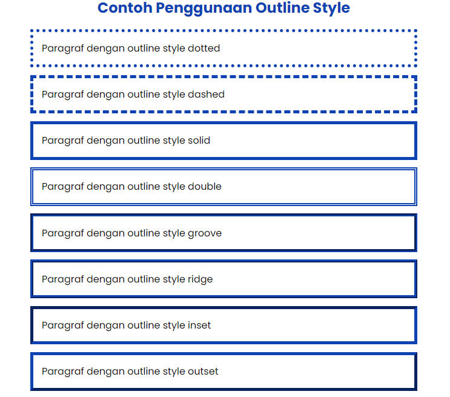

# CSS Outline

## Apa itu CSS Outline?

Properti CSS `outline` adalah garis yang terletak setelah border dari sebuah elemen.

CSS sendiri menyediakan banyak fitur yang bisa digunakan untuk mengatur sebuah `outline`, seperti mengatur style garis, pewarnaan dan ukuran.

Perlu diketahui juga bahwa properti CSS `outline` adalah singkatan dari properti : 

- `outline-color`
- `outline-style`
- `outline-width`


Ilustrasi dari sebuah outline bisa dilihat pada gambar di bawah ini : 


## CSS Outline Style

Value dari properti `outline-style` : 

- `dotted` 
- `dashed` 
- `solid`
- `double`
- `groove`
- `ridge`
- `inset`
- `outset`
- `none`
- `hidden`

## Sintaksis 

```css 
/* style */
outline: solid;
```

```css 
/* color | style */
outline: #1043B2 solid;
```

```css 
/* color | style | width */
outline: #1043B2 solid 3px;
```

## Contoh penggunaan

**Kode HTML**

```html
<div class="container">
    <h2>Contoh Penggunaan Outline Style</h2>
    <p class="dotted">Paragraf dengan outline style dotted</p>
    <p class="dashed">Paragraf dengan outline style dashed</p>
    <p class="solid">Paragraf dengan outline style solid</p>
    <p class="double">Paragraf dengan outline style double</p>
    <p class="groove">Paragraf dengan outline style groove</p>
    <p class="ridge">Paragraf dengan outline style ridge</p>
    <p class="inset">Paragraf dengan outline style inset</p>
    <p class="outset">Paragraf dengan outline style outset</p>
</div>
```

**Kode CSS**

```css
p.dotted {
outline: #1043B2 dotted 5px;
}
  
p.dashed {
outline: #1043B2 dashed 5px;
}

p.solid {
outline: #1043B2 solid 5px;
}

p.double {
outline: #1043B2 double 5px;
}

p.groove {
outline: #1043B2 groove 5px;
}

p.ridge {
outline: #1043B2 ridge 5px;
}

p.inset {
outline: #1043B2 inset 5px;
}

p.outset {
outline: #1043B2 outset 5px;
}
```

## Hasil




## Keterangan
Seperti yang kalian lihat pada gambar diatas, `outline` sangatlah mirip dengan `border`. 
Meskipun terlihat sama, namun `outline` memiliki perbedaan sebagai berikut :   

- `outline` tidak memakan tempat sehingga tidak mengubah ukuran atau posisi sebuah elemen.
- `outline` tidak bisa mengatur setiap sudut secara individu, `outline` hanya bisa mengatur semua sudutnya sekaligus.
- menurut spesifikasinya `outline` tidak harus berbentuk persegi panjang.


## Untuk referensi lengkapnya, kalian bisa mengunjungi website berikut:

- [MDN Web Docs](https://developer.mozilla.org/en-US/docs/Web/CSS/outline)
- [W3Schools](https://www.w3schools.com/css/css_outline.asp)


