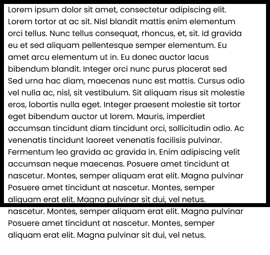
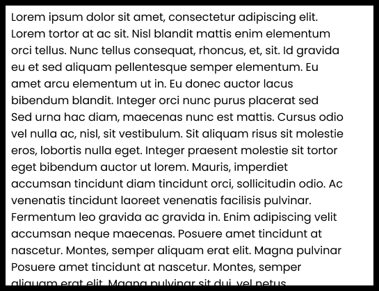
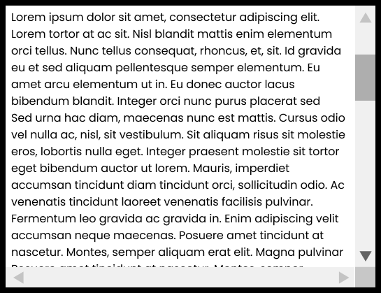

### CSS Overflow

### Apa Itu CSS Overflow?

**CSS Overflow** sendiri adalah properti CSS yang biasa digunakan untuk menentukan sifat suatu konten ketika melewati container atau pembungkusnya, contoh kasus ketika kita membuat sebuah sebuah kotak semisal dengan tag `<div>` dan didalamnya terdapat sebuah text dan dibungkus oleh tag `<p>` yang keluar container atau pembungkusnya itu disebut dengan `overflow`.

NOTE : Properti `overflow` digunakan untuk menentukan sifat dari sebuah element yang keluar dari container atau pembungkusnya akan dipotong atau menambahkan scroll. Secara default overflow mempunya value `visible` yang artinya konten yang keluar dari container atau pembungkusnya akan ditampilkan.

CSS Overflow mempunyai 4 value, antara lain :

- `overflow: visible` - Default. Konten yang keluar container atau pembungkus akan ditampilkan keluar container.



- `overflow: hidden` - Konten akan disembunyikan dan seolah terpotong container / pembungkusnya.



- `overflow: scroll` - Konten akan terpotong dan dan akan ada `scroll` component untuk melihat konten lainnya.



- `overflow: auto` - Hampir sama dengan `scroll`, dengan mengimplementasikan value `auto` scroll hanya muncul ketika sebuah element overflow.


## Contoh Penggunaan :

```css
div {
	width: 100px;
	height: 100px;
	background-color: #eee;
	overflow: scroll; //sesuaikan kebutuhan
}
```

Untuk referensi lengkapnya, kalian bisa mengunjungi website berikut:

- [MDN Web Docs](https://developer.mozilla.org/en-US/docs/Web/CSS/CSS_Overflow)
- [W3Schools](https://www.w3schools.com/css/css_overflow.asp)
