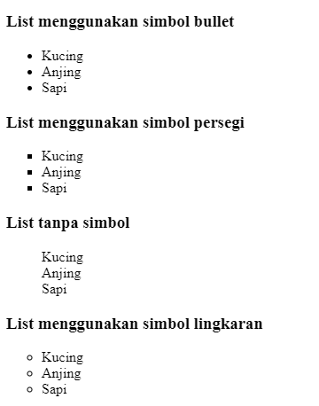
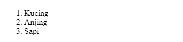
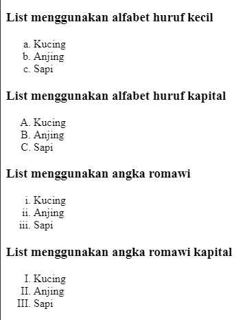
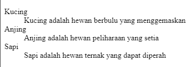

# HTML Lists

## Apa Itu HTML List ?

HTML List adalah elemen untuk menyajikan data berupa list/daftar.

Ada tiga macam list dalam HTML dan masing-masing memiliki tujuan dan makna tertentu.

- **Unordered list** - Digunakan untuk membuat daftar item, tanpa urutan tertentu.
- **Ordered list** - Digunakan untuk membuat daftar item, dalam urutan tertentu.
- **Description list** - Digunakan untuk membuat daftar item dan deskripsinya.

### Unordered List

Unordered list adalah daftar item yang tidak memiliki urutan khusus. Unordered list dibuat dengan tag `<ul>`, dan untuk item-nya dibuat menggunakan tag `<li>`.

Contoh:

```html
<ul>
  <li>Kucing</li>
  <li>Anjing</li>
  <li>Sapi</li>
</ul>
```

Hasilnya:


Secara default, list akan diurutkan dengan simbol bullet (disc).

Bagaimana jika ingin mengurutkan dengan simbol lainnya?

Untuk mengganti disc dengan simbol lain, cukup berikan atribut `type` pada tag `ul` seperti berikut.

- Type `disc` untuk simbol bullet (default).
- Type `square` untuk simbol persegi.
- Type `none` untuk menghilangkan simbol atau tanpa simbol.
- Type `circle` untuk simbol lingkaran.

Contoh:

```html
<h3>List menggunakan simbol bullet</h3>
<ul type="disc">
  <li>Kucing</li>
  <li>Anjing</li>
  <li>Sapi</li>
</ul>
<h3>List menggunakan simbol persegi</h3>
<ul type="square">
  <li>Kucing</li>
  <li>Anjing</li>
  <li>Sapi</li>
</ul>
<h3>List tanpa simbol</h3>
<ul type="none">
  <li>Kucing</li>
  <li>Anjing</li>
  <li>Sapi</li>
</ul>
<h3>List menggunakan simbol lingkaran</h3>
<ul type="circle">
  <li>Kucing</li>
  <li>Anjing</li>
  <li>Sapi</li>
</ul>
```

Hasilnya:



### Ordered List

Ordered list adalah daftar item yang memiliki urutan tertentu. Ordered list dibuat dengan tag `<ol>`, dan untuk item-nya dibuat menggunakan tag `<li>`.

Contoh:

```html
<ol>
  <li>Kucing</li>
  <li>Anjing</li>
  <li>Sapi</li>
</ol>
```

Hasilnya:



Secara default, list akan diurutkan berdasarkan angka 1 sampai seterusnya.

Bagaimana jika ingin mengurutkan list dengan menggunakan a, b, c atau angka romawi?

Untuk mengganti angka dengan huruf ataupun angka romawi, cukup berikan atribut `type` pada tag `ol` seperti berikut.

- Type `a` untuk huruf alfabet a, b, c dan seterusnya.
- Type `A` untuk huruf alfabet A, B, C dan seterusnya.
- Type `i` untuk angka romawi i, ii, iii dan seterusnya.
- Type `I` untuk angka romawi I, II, III dan seterusnya.

Contoh:

```html
<h3>List menggunakan alfabet huruf kecil</h3>
<ol type="a">
  <li>Kucing</li>
  <li>Anjing</li>
  <li>Sapi</li>
</ol>
<h3>List menggunakan alfabet huruf kapital</h3>
<ol type="A">
  <li>Kucing</li>
  <li>Anjing</li>
  <li>Sapi</li>
</ol>
<h3>List menggunakan angka romawi</h3>
<ol type="i">
  <li>Kucing</li>
  <li>Anjing</li>
  <li>Sapi</li>
</ol>
<h3>List menggunakan angka romawi kapital</h3>
<ol type="I">
  <li>Kucing</li>
  <li>Anjing</li>
  <li>Sapi</li>
</ol>
```

Hasilnya:



### Description Lists

Description list adalah daftar item yang berisi deskripsi dari sesuatu.
Description list dibuat dengan tag `<dl>`, untuk membuat kata yang akan dideskripsikan menggunakan `<dt>`, dan untuk mendeskiprsikan kata yang sudah dibuat tadi, kita dapat menggunakan tag `<dd>`.

Contoh:

```html
<dl>
  <dt>Kucing</dt>
  <dd>Kucing adalah hewan berbulu yang menggemaskan</dd>
  <dt>Anjing</dt>
  <dd>Anjing adalah hewan peliharaan yang setia</dd>
  <dt>Sapi</dt>
  <dd>Sapi adalah hewan ternak yang dapat diperah</dd>
</dl>
```

Hasilnya:


