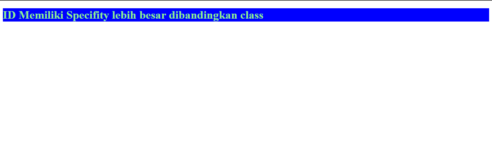

# HTML ID

ID adalah attribute pada HTML yang digunakan untuk memberikan tanda pada element HTML yang sifatnya unique.
Unique? Artinya kalian tidak boleh memiliki element dengan ID yang sama di dalam HTML. Cara mengakses
ID di dalam CSS adalah dengan tanda pagar (#), misalnya seperti di bawah ini:

```html
<!DOCTYPE html>
<html lang="en">
  <head>
    <title>HTML ID</title>
    <style>
      #coba-id {
        color: lightblue;
        background-color: teal;
      }
    </style>
  </head>
  <body>
    <h1 id="coba-id">memberi style pada id</h1>
  </body>
</html>
```

Hasilnya:


## Perbedaan ID dengan class

- Element HTML boleh memiliki class yang sama, sementara ID tidak.
- ID memiliki `specifity` yang lebih besar dibanding dengan class, apa maksudnya ini? Lihat contoh dibawah agar lebih jelas.

```html
<!DOCTYPE html>
<html lang="en">
  <head>
    <title>Contoh Specifity Pada ID</title>
    <style>
      #ini-id {
        color: lightgreen;
        background-color: blue;
      }

      .ini-class {
        background-color: red;
        color: orange;
      }
    </style>
  </head>
  <body>
    <h1 id="ini-id" class="ini-class">ID Memiliki Specifity lebih besar dibandingkan class</h1>

    <!-- h1 di atas akan memiliki warna lightgreen dengan background blue, sesuai dengan style yang diberikan pada ID. -->
    <!-- Hal ini disebabkan karena ID memiliki speficity lebih besar dibandingkan dengan class. -->
  </body>
</html>
```

Hasilnya:


> Catatan:
>
> - Penulisan ID bersifat case sensitif, berarti `id="test-id"` dengan `id="TEST-ID"` itu berbeda.
> - Penulisan ID harus memiliki setidaknya 1 karakter.
> - Penulisan ID tidak boleh diawali dengan angka.
> - Penulisan ID tidak boleh mengandung spasi, tab, dan sejenisnya.

Referensi:

- [W3School](https://www.w3schools.com/html/html_id.asp)
- [MDN](https://developer.mozilla.org/en-US/docs/Web/HTML/Global_attributes/id)
