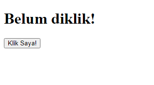
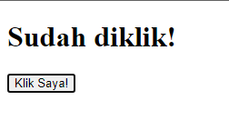

# HTML Script

Dalam HTML, tag `<script>` digunakan untuk menyisipkan script, biasanya menggunakan Javascript. Kenapa
kita membutuhkan script? Hal ini diperlukan untuk membuat website kita menjadi semakin interaktif.
kalian bisa menuliskan script langsung di dalam HTML atau bisa juga dipisah menjadi file
yang berbeda lalu tambahkan attribute `src=""` untuk menyambungkan script tersebut.

Memanipulasi website dengan Javascript disebut dengan _DOM Manipulation_. Kalian bisa belajar
Tentang _DOM Manpipulation_ di repository bellshade Javascript [disini](https://github.com/bellshade/Javascript/tree/main/learn/DOM)

## Contoh Penggunaan `<script>`

```html
<html lang="en">
  <head>
    <title>Script</title>
  </head>
  <body>
    <h1 id="h1">Belum diklik!</h1>
    <button id="button">Klik Saya!</button>

    <script>
      document.getElementById("button").addEventListener("click", function () {
        document.getElementById("h1").innerText = "Sudah diklik!";
      });
    </script>
  </body>
</html>
```

Hasilnya:

- 
- 

## Attribute yang ada pada `<script>`

| Attribute        | value                                                                                                                                                              | Deskripsi                                                                                                                                                                                                                                                                  |
| ---------------- | ------------------------------------------------------------------------------------------------------------------------------------------------------------------ | -------------------------------------------------------------------------------------------------------------------------------------------------------------------------------------------------------------------------------------------------------------------------- |
| `async`          | async                                                                                                                                                              | digunakan untuk membuat script didownload saat HTML sedang di parse, lalu setelah selesai didownload, script langsung dieksekusi/dijalankan tanpa perlu menunggu pada titik yang memiliki tag `<script>`. (Attribute ini hanya bisa digunakan pada script eksternal)       |
| `crossorigin`    | `anonymous`, `use-credential`                                                                                                                                      | Membuat mode request menjadi HTTP CORS Request                                                                                                                                                                                                                             |
| `defer`          | defer                                                                                                                                                              | digunakan untuk membuat script didownload pada saat HTML sedang diparse. setelah selesai didownload, script tidak langsung dieksekusi. Script baru dieksekusi dan dijalankan ketika HTML telah selesai diparse. (Attribute ini hanya bisa digunakan pada script eksternal) |
| `integrity`      | _hash file_                                                                                                                                                        | digunakan untuk mengizinkan browser memeriksa script yang diambil untuk memastikan bahwa jangan jalankan apabila sumber dimanipulasi.                                                                                                                                      |
| `nomodule`       | `true`, `false`                                                                                                                                                    | digunakan untuk menentukan bahwa script tidak boleh dijalankan di browser yang mendukung modul ES2015                                                                                                                                                                      |
| `reffererpolicy` | `no-referrer`, `no-referrer-when-downgrade`, `origin`, `origin-when-cross-origin`, `same-origin`, `strict-origin`, `strict-origin-when-cross-origin`, `unsafe-url` | digunakan untuk menentukan informasi mana yang akan dikirim saat mengambil skrip                                                                                                                                                                                           |
| `src`            | _URL_                                                                                                                                                              | digunakan untuk menentukan url dari file script yang akan digunakan                                                                                                                                                                                                        |
| `type`           | _scripttype_                                                                                                                                                       | digunakan untuk menentukan jenis media dari script                                                                                                                                                                                                                         |

Referensi:

- [W3School](https://www.w3schools.com/html/html_scripts.asp)
