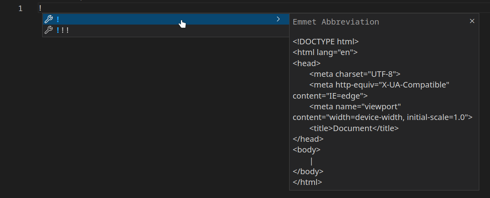
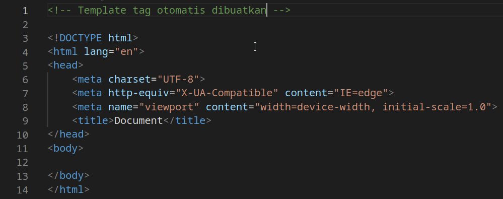
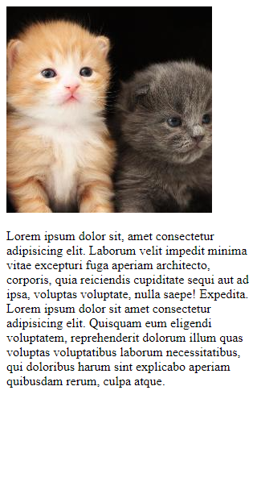

# HTML Responsive

## Apa itu HTML Responsive?

HTML Responsive berfungsi agar *website* kamu bisa terlihat bagus di semua perangkat diantaranya PC/Laptop, tablet, dan handphone.

## Viewport

Agar *website* kamu bisa terlihat bagus di semua perangkat, kamu harus menambahkan *viewport* terlebih dahulu

Caranya kamu hanya perlu membuat tag bernama `<meta>` di antara `<head>` dan `</head>` (header)

```html
<meta>
```

Setelah menambahkan tag `<meta>`, sekarang kamu perlu menambahkan beberapa attribut di dalam tag `<meta>`. yaitu `name`, `content`.

```html
name="viewport" content="width=device-width, initial-scale=1.0"
```

Setelah menambahkan tag `<meta>` beserta attributnya, seharusnya di dalam tag `<head>` *website* kamu sudah memiliki ini:

```html
<meta name="viewport" content="width=device-width, initial-scale=1.0">
```

## Emmet Abbreviation

Untuk beberapa IDE seperti Visual Studio Code, sudah tersedia emmet yang berguna untuk mempermudah pembuatan tag-tag diatas. Yaitu dengan mengetik tanda `!` lalu tekan `Enter`.





## Contoh sebelum dan sesudah menambahkan viewport

### Sebelum


### Sesudah


